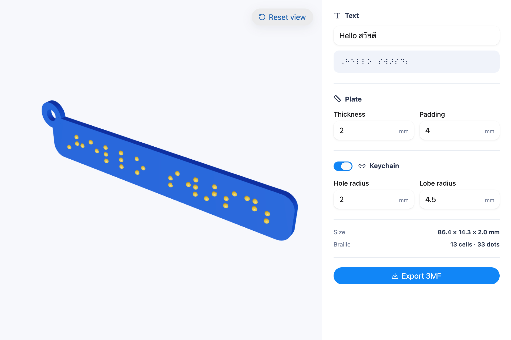

# Braille Tag Maker

**A web app for making 3D printable Thai and English Braille tags.**

[Open the app](https://h11maitree.github.io/braille-tag/) · [Report an issue](https://github.com/H11Maitree/braille-tag/issues)



Braille Tag Maker turns mixed Thai and English text into raised 6-dot Braille, previews the result in 3D, and exports a printable `.3mf` file. Translation, layout, geometry, booleans, and export all run locally in the browser—your text never leaves your device.

## Features

- Mixed Thai and English Grade-1 Braille, including numbers, punctuation, and indicators
- Explicit newlines and blank lines are preserved exactly; the editor never silently wraps the physical Braille layout
- Fixed tactile Braille dimensions with a plate that grows to fit the content
- Smooth raised spherical-cap Braille dots and a rounded printable plate
- Optional top-left keychain lobe with a complete through-hole and material-wall validation
- Interactive Three.js preview with orbit controls and dynamic camera fitting
- One merged, manifold manufacturing solid generated with Manifold
- Standards-shaped, millimetre-based `.3mf` export generated entirely in the browser
- Compact shareable URLs—no account, server, local storage, or cloud processing required

## How it works

1. Enter Thai, English, or a mixture of both.
2. Adjust the plate or enable the keychain attachment.
3. Inspect the tag in the live 3D preview.
4. Export a printable `.3mf` file.

## Braille translation

The app uses the Liblouis WebAssembly runtime and the official Liblouis **3.37.0** Thai Grade-1 table (`th-g1.utb`). That table includes `en-ueb-g1.ctb`, so Thai and English are translated together through one Unicode-Braille translation path. Each user-entered line is translated independently after Windows newline normalization, preserving manual and blank rows.

## Physical dimensions

Braille measurements are intentionally fixed instead of being scaled with the plate:

| Measurement | Value |
| --- | ---: |
| Dot diameter | 1.55 mm |
| Raised dot height | 0.70 mm |
| Intra-cell pitch | 2.40 mm |
| Cell pitch | 6.20 mm |
| Line pitch | 10.00 mm |

The plate padding is also its rounded-corner radius. With a keychain enabled, the top-left plate corner becomes square and a disk centred at that original corner is merged into the plate; its central opening is subtracted as a full through-hole.

## Development

### Requirements

- Current Node.js LTS (Node 24 recommended)
- A modern browser with WebAssembly support (Chromium, Firefox, or Safari)

### Install and run

```bash
npm install
npm run dev
```

### Verify a production build

```bash
npm test
npm run build
```

## Deployment

The included GitHub Actions workflow builds, tests, and publishes the static app to GitHub Pages after each push to `main`. In the repository’s **Settings → Pages**, choose **GitHub Actions** as the publishing source once.

## Printing notes

The exporter creates a 3MF OPC package containing one indexed mesh in millimetres. Geometry is validated for finite vertices, valid triangle indices, and non-empty output before download.

The generated files should be imported and checked in your own slicer and print workflow. This project uses selected tactile dimensions, but it is not a substitute for professional review or a determination of legal accessibility-signage compliance.

## License

This project’s application code is available under the [MIT License](LICENSE).

Liblouis and its table assets are distributed under their own LGPL-2.1-or-later licensing and copyright notices. Review those terms before redistributing the bundled runtime or translation tables.
